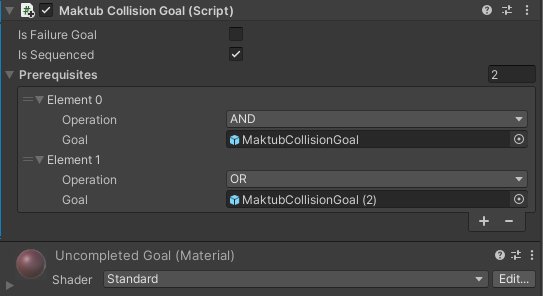

# Maktub

Maktub is a Unity package that allows for the visual and intuitive creation of test oracles. These oracles can be used to quickly create integration tests for robot simulation systems.

## Constructing Oracles Through Goals

Maktub works by allowing test designers to place down and link together "goals" in order to define a test. There are two types of goals currently available:

* Collision Goals
  * A collision goal is a bounding box that is marked as complete once a robot enters it.
* Pose Goals
  * A pose goal defines an orientation that a robot must match within a given tolerance before it can be marked as complete.

These goals can also be flagged as "failure" goals, meaning that if they are completed, the test will fail. This is useful for setting orientations the robot must not reach, or areas it must not enter.

## Integration with ROS
Information on a test (such as what goals have been completed and if the test has finished or failed) is published to the ROS topic: `maktub/test_log`. This topic can be used to construct ROSTest scripts that allow Maktub tests to easily integrate with other robot tests.

## How to Use

After importing Maktub into your Unity project, each test scene needs to have a `Maktub Root` in it. This can be found in the `Prefabs` folder and placed anywhere in the scene. Now collision and rotation goals can be placed in your scene. If you select a goal after placing it and look at its inspector tab you will see a series of options:
* Is Failure Goal
  * Tells Maktub whether or not this goal being completed counts as a failure or a success for the test
* Is Sequenced
  * Tells Maktub whether or not this goal needs to have other goals completed before this one can be marked as complete
* Prerequisites
  * This tab only appears if `Is Sequenced` has been checked off
  * This is a list that can be expanded to include as many prerequisite goals as you want
  * Each element has a goal object and an operator (AND or OR) that chains them together
    * the first elements `operation` does nothing (the fact that it has one is a bug and will be fixed eventually)

## Dependencies
This package requires that the ROS-TCP-CONNECTOR Unity package is installed in your project.